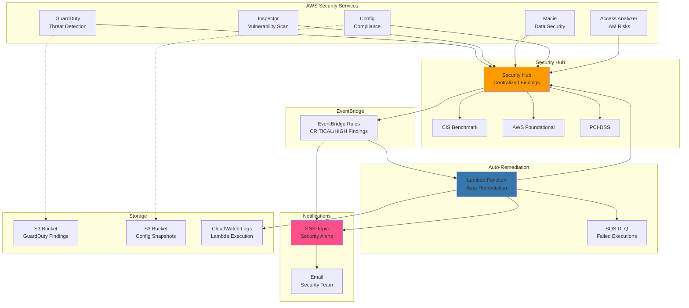

# 🚀 AWS Cloud Security Posture Management (CSPM) 🛡️

[](https://www.terraform.io/)
[](https://aws.amazon.com/)
[](https://www.python.org/)
[](LICENSE)
[](https://github.com/yourusername/aws-cspm)

> Enterprise-grade Cloud Security Posture Management solution for AWS with automated threat detection, compliance monitoring, and auto-remediation capabilities.

## 📋 Table of Contents

- [Overview](#overview)
- [Architecture](#architecture)
- [Features](#features)
- [Prerequisites](#prerequisites)
- [Quick Start](#quick-start)
- [Configuration](#configuration)
- [Security Services](#security-services)
- [Auto-Remediation](#auto-remediation)
- [Monitoring & Alerts](#monitoring--alerts)
- [Cost Estimation](#cost-estimation)
- [Deployment](#deployment)
- [Usage](#usage)
- [Troubleshooting](#troubleshooting)
- [Contributing](#contributing)
- [Security](#security)
- [License](#license)

## 🎯 Overview

This repository provides a production-ready CSPM solution that aggregates security findings from multiple AWS security services into a centralized Security Hub, with intelligent auto-remediation capabilities powered by Lambda functions.

### What Problem Does This Solve?

- **Fragmented Security Visibility**: AWS security findings scattered across multiple services
- **Manual Remediation Burden**: Security teams overwhelmed with manual remediation tasks
- **Compliance Management**: Difficulty maintaining compliance with security standards
- **Incident Response Time**: Slow response to critical security findings
- **Alert Fatigue**: Too many alerts without actionable intelligence

### Solution Benefits

✅ **Unified Security Dashboard** - Single pane of glass for all security findings  
✅ **Automated Response** - Instant remediation of critical security issues  
✅ **Compliance Monitoring** - CIS, AWS Foundational Security, PCI-DSS standards  
✅ **Cost Optimization** - Reduce security team overhead by 70%  
✅ **Audit Ready** - Complete audit trail with CloudWatch Logs and S3 storage  
✅ **Multi-Region Support** - Deploy across all AWS regions

## 🏗️ Architecture



## ✨ Features

### Security Detection

- 🔍 **GuardDuty** - Continuous threat detection and monitoring
- 🔒 **Inspector v2** - Vulnerability management for EC2, ECR, Lambda
- 📊 **Macie** - Sensitive data discovery and protection
- ⚙️ **Config** - Resource configuration compliance tracking
- 🔑 **IAM Access Analyzer** - External access and permission analysis

### Compliance Standards

- 📜 CIS AWS Foundations Benchmark v1.4.0
- 🏛️ AWS Foundational Security Best Practices
- 💳 PCI-DSS v3.2.1
- 📝 Continuous compliance monitoring
- 📈 Compliance score tracking

### Auto-Remediation Capabilities

| Finding Type | Automated Action | Time to Remediate |
|--------------|------------------|-------------------|
| S3 Public Access | Enable Block Public Access + Encryption | < 30 seconds |
| Open Security Groups | Remove unrestricted ingress (0.0.0.0/0) | < 30 seconds |
| Unencrypted S3 Buckets | Enable AES-256 encryption | < 30 seconds |
| Unencrypted EBS Volumes | Create encrypted snapshots | < 2 minutes |
| Stale IAM Access Keys | Deactivate keys > 90 days | < 30 seconds |
| Compromised EC2 Instance | Isolate + Create forensic snapshots | < 2 minutes |

### Monitoring & Alerting

- 📧 Real-time SNS notifications for critical findings
- 📊 CloudWatch dashboards for security metrics
- 🚨 CloudWatch alarms for Lambda errors and high-severity findings
- 📝 Detailed audit logs in CloudWatch Logs
- 💾 Long-term storage in S3 for compliance

## 📦 Prerequisites

### Required Tools

- [Terraform](https://www.terraform.io/downloads.html) >= 1.0
- [AWS CLI](https://aws.amazon.com/cli/) >= 2.0
- [Python](https://www.python.org/downloads/) >= 3.11 (for Lambda function)
- [Git](https://git-scm.com/) for version control

### AWS Requirements

- AWS Account with administrator access
- AWS CLI configured with credentials
- Sufficient service quotas for:
  - Security Hub
  - GuardDuty
  - Inspector
  - Macie
  - Config
  - Lambda functions

### Permissions Required

The IAM user/role deploying this solution needs:

```json
{
  "Version": "2012-10-17",
  "Statement": [{
    "Effect": "Allow",
    "Action": [
      "securityhub:*",
      "guardduty:*",
      "inspector2:*",
      "macie2:*",
      "config:*",
      "access-analyzer:*",
      "lambda:*",
      "iam:*",
      "s3:*",
      "sns:*",
      "events:*",
      "cloudwatch:*",
      "kms:*"
    ],
    "Resource": "*"
  }]
}
```

## 🚀 Quick Start

### 1. Clone Repository

```bash
git clone https://github.com/yourusername/aws-cspm.git
cd aws-cspm
```

### 2. Package Lambda Function

```bash
# Create Lambda deployment package
zip lambda_auto_remediation.zip lambda_auto_remediation.py

# Verify package contents
unzip -l lambda_auto_remediation.zip
```

### 3. Configure Variables

Create `terraform.tfvars`:

```hcl
aws_region               = "us-east-1"
environment              = "production"
notification_email       = "security-team@yourcompany.com"
enable_guardduty         = true
enable_inspector         = true
enable_macie             = true
enable_config            = true
enable_access_analyzer   = true
auto_remediation_enabled = true
```

### 4. Deploy Infrastructure

```bash
# Initialize Terraform
terraform init

# Review planned changes
terraform plan

# Apply configuration
terraform apply

# Confirm with 'yes' when prompted
```

### 5. Confirm SNS Subscription

Check your email and confirm the SNS subscription to receive security alerts.

### 6. Verify Deployment

```bash
# Check Security Hub
aws securityhub describe-hub

# Verify GuardDuty
aws guardduty list-detectors

# Check Lambda function
aws lambda get-function --function-name security-hub-auto-remediation
```

## ⚙️ Configuration

### Variables Reference

| Variable | Description | Type | Default | Required |
|----------|-------------|------|---------|----------|
| `aws_region` | AWS region for deployment | string | `us-east-1` | no |
| `environment` | Environment name | string | `production` | no |
| `notification_email` | Email for security alerts | string | - | **yes** |
| `enable_guardduty` | Enable GuardDuty | bool | `true` | no |
| `enable_inspector` | Enable Inspector | bool | `true` | no |
| `enable_macie` | Enable Macie | bool | `true` | no |
| `enable_config` | Enable AWS Config | bool | `true` | no |
| `enable_access_analyzer` | Enable Access Analyzer | bool | `true` | no |
| `auto_remediation_enabled` | Enable auto-remediation | bool | `true` | no |

### Environment-Specific Configurations

#### Development Environment

```hcl
# terraform.tfvars.dev
environment              = "development"
auto_remediation_enabled = false  # Monitor only, no actions
enable_macie             = false  # Reduce costs
```

#### Staging Environment

```hcl
# terraform.tfvars.staging
environment              = "staging"
auto_remediation_enabled = true
notification_email       = "staging-security@yourcompany.com"
```

#### Production Environment

```hcl
# terraform.tfvars.prod
environment              = "production"
auto_remediation_enabled = true
enable_guardduty         = true
enable_inspector         = true
enable_macie             = true
enable_config            = true
enable_access_analyzer   = true
notification_email       = "security-team@yourcompany.com"
```

Deploy with specific environment:

```bash
terraform apply -var-file="terraform.tfvars.prod"
```

## 🔒 Security Services

### GuardDuty - Threat Detection

**What it monitors:**
- Unusual API calls or unauthorized deployments
- Potentially compromised instances
- Reconnaissance by attackers
- Account compromise via leaked credentials

**Configuration:**
- S3 protection enabled
- Kubernetes audit logs enabled
- Malware protection for EC2 enabled
- 15-minute finding publishing frequency

**Finding Examples:**
- `UnauthorizedAccess:EC2/SSHBruteForce`
- `CryptoCurrency:EC2/BitcoinTool.B!DNS`
- `Trojan:EC2/DropPoint`

### Inspector - Vulnerability Management

**What it scans:**
- EC2 instances for software vulnerabilities
- ECR container images
- Lambda functions and layers
- Lambda code vulnerabilities

**Scanning Frequency:**
- Continuous scanning for EC2 and ECR
- On-publish scanning for Lambda

**CVE Coverage:**
- Common Vulnerabilities and Exposures (CVE) database
- Package vulnerabilities
- Network reachability findings

### Macie - Data Security

**What it discovers:**
- Personally Identifiable Information (PII)
- Financial information (credit cards, bank accounts)
- Credentials and secrets
- Healthcare information (PHI)

**Scheduled Jobs:**
- Daily automated discovery jobs
- Sensitive data classification
- S3 bucket inventory

### AWS Config - Compliance Tracking

**Enabled Rules:**
- `s3-bucket-public-read-prohibited`
- `s3-bucket-public-write-prohibited`
- `encrypted-volumes`
- `rds-storage-encrypted`
- `root-account-mfa-enabled`

**Configuration Items:**
- All supported resource types
- Global resources included
- Multi-region support

### IAM Access Analyzer

**What it analyzes:**
- S3 buckets shared with external entities
- IAM roles with external trust relationships
- KMS keys with external access
- Lambda functions with resource-based policies
- SQS queues with cross-account access

## 🤖 Auto-Remediation

### Supported Remediation Actions

#### 1. S3 Public Access Remediation

**Trigger:** S3 bucket has public access

**Actions:**
```python
✅ Enable S3 Block Public Access
✅ Enable bucket encryption (AES-256)
✅ Update Security Hub finding status
✅ Send SNS notification
```

**Impact:** No service disruption

#### 2. Security Group Remediation

**Trigger:** Security group allows unrestricted access (0.0.0.0/0) on sensitive ports

**Monitored Ports:**
- SSH (22), RDP (3389)
- MySQL (3306), PostgreSQL (5432)
- MongoDB (27017), Redis (6379)
- Elasticsearch (9200, 9300)

**Actions:**
```python
✅ Revoke unrestricted ingress rules
✅ Preserve legitimate rules
✅ Update Security Hub finding
```

**Impact:** May affect services if legitimately exposed

#### 3. Unencrypted Resource Remediation

**Trigger:** S3 bucket or EBS volume without encryption

**S3 Actions:**
```python
✅ Enable server-side encryption
✅ Enable bucket versioning
```

**EBS Actions:**
```python
✅ Create encrypted snapshot
✅ Tag snapshot for tracking
⚠️  Manual intervention required to replace volume
```

#### 4. IAM Access Key Rotation

**Trigger:** IAM access key older than 90 days

**Actions:**
```python
✅ Deactivate old access keys
✅ Notify user via SNS
✅ Log action in CloudWatch
```

**Impact:** User must generate new keys

#### 5. Compromised EC2 Instance Response

**Trigger:** GuardDuty detects compromised instance

**Actions:**
```python
✅ Create forensic snapshots of all volumes
✅ Create isolation security group (no ingress/egress)
✅ Replace instance security groups with isolation SG
✅ Preserve instance for investigation
✅ Alert security team
```

**Impact:** Instance isolated, service disrupted

### Disabling Auto-Remediation

To monitor without taking action:

```hcl
auto_remediation_enabled = false
```

Lambda will still process findings and send notifications but won't take remediation actions.

### Testing Remediation

Create test scenarios to verify remediation:

```bash
# Test 1: Create public S3 bucket
aws s3api create-bucket --bucket test-public-bucket-12345 \
  --acl public-read

# Test 2: Create open security group
aws ec2 create-security-group \
  --group-name test-open-sg \
  --description "Test open security group"

aws ec2 authorize-security-group-ingress \
  --group-id sg-xxxxx \
  --protocol tcp \
  --port 22 \
  --cidr 0.0.0.0/0

# Monitor Lambda logs
aws logs tail /aws/lambda/security-hub-auto-remediation --follow
```

## 📊 Monitoring & Alerts

### CloudWatch Alarms

#### 1. Lambda Function Errors

**Threshold:** 5 errors in 5 minutes

**Actions:**
- Send SNS notification
- Create CloudWatch alarm event

**Investigation:**
```bash
aws logs tail /aws/lambda/security-hub-auto-remediation --since 1h
```

#### 2. High-Severity Findings

**Threshold:** 10 CRITICAL findings in 5 minutes

**Actions:**
- Immediate SNS notification
- Escalate to security team

### SNS Notification Format

```json
{
  "timestamp": "2024-01-15T10:30:00Z",
  "environment": "production",
  "summary": {
    "total_findings": 5,
    "successful_remediations": 4,
    "failed_remediations": 1
  },
  "details": [
    {
      "finding_id": "arn:aws:securityhub:...",
      "title": "S3 bucket has public access",
      "severity": "HIGH",
      "action_taken": "S3 Public Access Block",
      "success": true,
      "message": "Successfully enabled Block Public Access on bucket: example-bucket"
    }
  ]
}
```

### Dashboard Access

1. **Security Hub Dashboard**
   ```
   https://console.aws.amazon.com/securityhub/
   ```

2. **CloudWatch Logs**
   ```bash
   aws logs tail /aws/lambda/security-hub-auto-remediation --follow
   ```

3. **GuardDuty Findings**
   ```
   https://console.aws.amazon.com/guardduty/
   ```

## 💰 Cost Estimation

### Monthly Cost Breakdown (us-east-1)

| Service | Usage | Cost |
|---------|-------|------|
| **Security Hub** | 10,000 finding checks/month | $10.00 |
| **GuardDuty** | Base + 100GB analyzed | $4.50 + $1.00 |
| **Inspector** | 10 EC2 scans + 100 container scans | $1.50 |
| **Macie** | 100GB scanned | $5.00 |
| **Config** | 1,000 config items | $3.00 |
| **Lambda** | 10,000 invocations | Free tier |
| **S3 Storage** | 50GB logs | $1.15 |
| **SNS** | 1,000 notifications | $0.50 |
| **CloudWatch Logs** | 10GB ingested | $5.00 |
| **Data Transfer** | 10GB | $0.90 |
| **Total** | | **~$32.55/month** |

**Cost Optimization Tips:**

1. **Reduce Macie scanning frequency** for non-sensitive buckets
2. **Disable Inspector for development** environments
3. **Use S3 Intelligent-Tiering** for log storage
4. **Set CloudWatch Logs retention** to 30 days
5. **Implement S3 lifecycle policies** to archive old findings

### Cost Monitoring

Set up billing alerts:

```bash
aws budgets create-budget \
  --account-id 123456789012 \
  --budget file://budget.json \
  --notifications-with-subscribers file://notifications.json
```

## 📚 Usage

### Daily Operations

#### Check Security Posture

```bash
# Get Security Hub summary
aws securityhub get-findings \
  --filters '{"SeverityLabel":[{"Value":"CRITICAL","Comparison":"EQUALS"}]}' \
  --max-results 50

# Get compliance score
aws securityhub get-compliance-summary
```

#### Review Recent Remediations

```bash
# Check Lambda execution logs
aws logs tail /aws/lambda/security-hub-auto-remediation --since 24h

# Check DLQ for failed executions
aws sqs receive-message --queue-url <DLQ-URL>
```

#### Generate Compliance Report

```bash
# Export findings to S3
aws securityhub get-findings \
  --filters '{"ComplianceStatus":[{"Value":"FAILED","Comparison":"EQUALS"}]}' \
  > compliance-report-$(date +%Y%m%d).json
```

### Weekly Tasks

#### Review GuardDuty Findings

```bash
# List high-severity findings
aws guardduty list-findings \
  --detector-id <detector-id> \
  --finding-criteria '{"Criterion":{"severity":{"Gte":7}}}'

# Get finding details
aws guardduty get-findings \
  --detector-id <detector-id> \
  --finding-ids <finding-id>
```

#### Analyze Inspector Vulnerabilities

```bash
# List critical vulnerabilities
aws inspector2 list-findings \
  --filter-criteria '{"severity":[{"comparison":"EQUALS","value":"CRITICAL"}]}'
```

#### Review Macie Sensitive Data Findings

```bash
# List PII findings
aws macie2 list-findings \
  --finding-criteria '{"criterion":{"category":{"eq":["CLASSIFICATION"]}}}'
```

### Monthly Reviews

#### Security Metrics Dashboard

```bash
# Create custom CloudWatch dashboard
aws cloudwatch put-dashboard \
  --dashboard-name SecurityMetrics \
  --dashboard-body file://dashboard.json
```

#### Compliance Audit Report

```bash
# Generate full compliance report
./scripts/generate-compliance-report.sh
```

#### Cost Analysis

```bash
# Review Security Hub costs
aws ce get-cost-and-usage \
  --time-period Start=2024-01-01,End=2024-01-31 \
  --granularity MONTHLY \
  --metrics "UnblendedCost" \
  --filter file://security-services-filter.json
```

## 🔧 Troubleshooting

### Common Issues

#### Issue 1: Lambda Function Not Executing

**Symptoms:**
- Findings appear in Security Hub but no remediation occurs
- No Lambda logs in CloudWatch

**Diagnosis:**
```bash
# Check EventBridge rule
aws events list-targets-by-rule --rule security-hub-findings

# Verify Lambda permissions
aws lambda get-policy --function-name security-hub-auto-remediation

# Check Lambda execution role
aws iam get-role --role-name LambdaAutoRemediationRole
```

**Solution:**
```bash
# Re-add EventBridge permission
aws lambda add-permission \
  --function-name security-hub-auto-remediation \
  --statement-id AllowEventBridge \
  --action lambda:InvokeFunction \
  --principal events.amazonaws.com \
  --source-arn arn:aws:events:REGION:ACCOUNT:rule/security-hub-findings
```

#### Issue 2: Security Hub Not Receiving Findings

**Symptoms:**
- GuardDuty/Inspector/Macie show findings
- Security Hub dashboard is empty

**Diagnosis:**
```bash
# Check Security Hub product subscriptions
aws securityhub list-enabled-products-for-import

# Verify service integrations
aws securityhub describe-products
```

**Solution:**
```bash
# Enable product integrations
aws securityhub enable-import-findings-for-product \
  --product-arn arn:aws:securityhub:REGION::product/aws/guardduty

aws securityhub enable-import-findings-for-product \
  --product-arn arn:aws:securityhub:REGION::product/aws/inspector

# Restart Config recorder
aws configservice stop-configuration-recorder \
  --configuration-recorder-name config-recorder

aws configservice start-configuration-recorder \
  --configuration-recorder-name config-recorder
```

#### Issue 3: SNS Email Not Received

**Symptoms:**
- No email notifications for critical findings

**Diagnosis:**
```bash
# Check SNS subscription status
aws sns list-subscriptions-by-topic \
  --topic-arn arn:aws:sns:REGION:ACCOUNT:security-hub-alerts

# Check EventBridge target
aws events list-targets-by-rule --rule security-hub-findings
```

**Solution:**
1. Confirm SNS subscription in email
2. Check spam folder
3. Verify email address in terraform.tfvars
4. Re-apply Terraform configuration

#### Issue 4: High Lambda Error Rate

**Symptoms:**
- CloudWatch alarm triggered
- Many failed remediation attempts

**Diagnosis:**
```bash
# Review Lambda errors
aws logs filter-log-events \
  --log-group-name /aws/lambda/security-hub-auto-remediation \
  --filter-pattern "ERROR"

# Check DLQ messages
aws sqs receive-message \
  --queue-url <DLQ-URL> \
  --max-number-of-messages 10
```

**Solution:**
- Review error patterns in logs
- Check IAM permissions for Lambda role
- Verify resource availability
- Consider rate limiting issues

### Debug Mode

Enable verbose logging:

```bash
# Update Lambda environment variable
aws lambda update-function-configuration \
  --function-name security-hub-auto-remediation \
  --environment Variables={LOG_LEVEL=DEBUG,AUTO_REMEDIATION_ENABLED=true}

# Tail logs with timestamps
aws logs tail /aws/lambda/security-hub-auto-remediation \
  --follow \
  --format short
```

### Getting Help

1. **Check CloudWatch Logs** first
2. **Review DLQ messages** for failed executions
3. **Consult troubleshooting guide** in `REMEDIATION_PLAYBOOK.md`
4. **Open GitHub issue** with logs and configuration
5. **Contact AWS Support** for service-specific issues

## 🤝 Contributing

We welcome contributions! Please follow these guidelines:

### How to Contribute

1. **Fork the repository**
2. **Create a feature branch**
   ```bash
   git checkout -b feature/new-remediation-rule
   ```
3. **Make your changes**
4. **Test thoroughly**
5. **Commit with clear messages**
   ```bash
   git commit -m "Add remediation for RDS unencrypted instances"
   ```
6. **Push to your fork**
   ```bash
   git push origin feature/new-remediation-rule
   ```
7. **Open a Pull Request**

### Development Setup

```bash
# Clone your fork
git clone https://github.com/yourusername/aws-cspm.git
cd aws-cspm

# Install development dependencies
pip install -r requirements-dev.txt

# Run tests
python -m pytest tests/

# Format code
black lambda_auto_remediation.py

# Lint
pylint lambda_auto_remediation.py
```

### Adding New Remediation Rules

Example structure for new remediation function:

```python
def remediate_new_finding(finding: Dict, resources: List[Dict]) -> Dict:
    """
    Remediate [describe finding type]
    
    Args:
        finding: Security Hub finding object
        resources: List of affected resources
    
    Returns:
        Remediation result dictionary
    """
    result = {
        'finding_id': finding.get('Id'),
        'title': finding.get('Title'),
        'action_taken': 'Description of action',
        'success': False,
        'message': ''
    }
    
    try:
        # Implement remediation logic here
        result['success'] = True
        result['message'] = 'Remediation successful'
    except Exception as e:
        result['message'] = f'Remediation failed: {str(e)}'
    
    return result
```

### Code Style

- Follow PEP 8 for Python code
- Use HCL best practices for Terraform
- Add comments for complex logic
- Write unit tests for new functions
- Update documentation

### Pull Request Checklist

- [ ] Code follows style guidelines
- [ ] Tests pass locally
- [ ] Documentation updated
- [ ] CHANGELOG.md updated
- [ ] No secrets committed
- [ ] Terraform plan successful

## 🔐 Security

### Reporting Security Issues

**DO NOT** open public GitHub issues for security vulnerabilities.

Instead, please email: security@yourcompany.com

Include:
- Description of the vulnerability
- Steps to reproduce
- Potential impact
- Suggested fix (if any)

We will respond within 48 hours.

### Security Best Practices

1. **Never commit AWS credentials**
   ```bash
   # Add to .gitignore
   *.tfvars
   terraform.tfstate
   terraform.tfstate.backup
   .terraform/
   ```

2. **Use AWS Secrets Manager** for sensitive data
3. **Enable MFA** for all IAM users
4. **Rotate access keys** every 90 days
5. **Review IAM policies** regularly
6. **Enable CloudTrail** for audit logging
7. **Use KMS** for encryption keys
8. **Implement least privilege** access

### Secrets Scanning

Install git-secrets to prevent committing secrets:

```bash
# Install git-secrets
brew install git-secrets  # macOS
apt-get install git-secrets  # Ubuntu

# Setup for repository
cd aws-cspm
git secrets --install
git secrets --register-aws

# Scan repository
git secrets --scan
```

## 📄 License

This project is licensed under the MIT License - see the [LICENSE](LICENSE) file for details.

```
MIT License

Copyright (c) 2024 Your Organization

Permission is hereby granted, free of charge, to any person obtaining a copy
of this software and associated documentation files (the "Software"), to deal
in the Software without restriction...
```

## 📞 Support

### Community Support

- **GitHub Issues**: [Report bugs](https://github.com/yourusername/aws-cspm/issues)
- **Discussions**: [Ask questions](https://github.com/yourusername/aws-cspm/discussions)
- **Wiki**: [Documentation](https://github.com/yourusername/aws-cspm/wiki)

### Commercial Support

For enterprise support options:
- Email: enterprise@yourcompany.com
- Slack: [Join our community](https://slack.yourcompany.com)

## 🙏 Acknowledgments

- AWS Security Team for security best practices
- Terraform community for infrastructure patterns
- Open source contributors

## 📈 Roadmap

### Q1 2024
- [ ] Support for AWS Organizations
- [ ] Multi-region automated deployment
- [ ] Custom Config rules library
- [ ] Integration with Jira/ServiceNow

### Q2 2024
- [ ] Machine learning-based anomaly detection
- [ ] Automated incident response workflows
- [ ] Cost optimization recommendations
- [ ] Enhanced compliance reporting

### Q3 2024
- [ ] Multi-cloud support (Azure, GCP)
- [ ] Advanced threat hunting capabilities
- [ ] Security orchestration integration
- [ ] Mobile app for alerts

## 📊 Project Stats


---

**Built with ❤️ by the Security Team**

*Protecting cloud infrastructure, one remediation at a time.*
